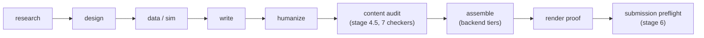

# Rigorloom

**A verifiable report pipeline for HWPX documents — deterministic gates,
graded render proof, Hancom-free by default.**

[](https://github.com/pantagram1031/rigorloom/actions/workflows/ci.yml)
[](LICENSE)
[](https://github.com/pantagram1031/rigorloom/tags)
[](pyproject.toml)
[](docs/golden-path.md)

Rigorloom is an agent-neutral, resumable workflow for weaving evidence,
personalization, document forms, verification, and delivery into one report
run. Current release: **v0.11.3**. See [CHANGELOG.md](CHANGELOG.md) for the
version history and [docs/golden-path.md](docs/golden-path.md) for an
end-to-end, Hancom-free walkthrough.

The state machine is deterministic and provider-independent. Claude, Codex,
Gemini, local models, human operators, or any other capable agent can act as
the orchestrator or worker. Model names in examples are optional adapters,
not requirements.

## Why rigorloom

- **Deterministic gates that can't be post-edited.** Script verdicts are
  computed by code and recorded as immutable inputs to state transitions —
  the old "caller-supplied-integer" bypass was retired in v0.7 (see
  [CHANGELOG.md](CHANGELOG.md)).
- **A graded render proof ladder, not a single pass/fail.** Delivery is
  ranked `none < experimental-rhwp < advisory < hancom`, and the ladder is
  cross-checked against what this machine can actually render, not trusted
  blindly.
- **Hancom-free HWPX assembly.** The `hwpx` backend fills a form's HWPX/OWPML
  XML directly through the external hwp-master engine, without Hancom or COM,
  on any OS.
- **Agent-neutral.** The stage machine drives entirely through CLIs; any
  coding-capable agent can orchestrate it, and provider roles are assigned by
  capability, not by vendor name (see [AGENTS.md](AGENTS.md)).

## Architecture



Stage 4.5 `content_audit` runs seven deterministic sub-checkers as
subprocesses before assembly is allowed to start; any sub-checker's HARD
finding fails the whole gate. Stage 6 `submission_preflight` grades the
finished artifact and requires a render `proof_grade` of `hancom` or
`advisory`. See [docs/pipeline-master-v0.6.md](docs/pipeline-master-v0.6.md)
for the full stage graph and gate contracts.

## Feature highlights

- A config-driven pipeline kernel (stage schema version `0.6`, unchanged
  since v0.7) with hard and human gates. The kernel is stable; everything
  below has been layered on top of it through the v0.7–v0.11 waves.
- A stage 4.5 **content audit** gate that runs seven deterministic
  sub-checkers before assembly ever starts, and a stage 6 **submission
  preflight** gate that grades the finished artifact before delivery.
- Four pluggable Stage 5 document backends — `bundle`, `docx`, `hwpx`, `hwp`
  — so the pipeline runs end to end without Hancom.
- Stage playbooks and a single master workflow document.
- Automatic handoff generation and safe archival after stage transitions.
- A privacy-first local Studio, read-only by default, for inspecting
  workspaces, resolved profiles, gates, evidence, document previews, and
  evaluation results. An opt-in, token-guarded action mode exists for
  triggering gates/builds from the UI.
- A robust workspace scaffolder and a `sync_local` base+overlay installer for
  shipping this pipeline as a Claude-style skill directory.
- An optional adapter for the separate
  [hwp-master](https://github.com/pantagram1031/hwp-master) project, which
  supplies both the Hancom-COM assembly loop and the Hancom-free HWPX XML
  engine.

Personal reports, student data, private templates, local logs, credentials,
and model-account configuration are intentionally excluded.

### Document backends

Stage 5 delivery is pluggable; pick the tier in `build.yaml` (`doc_backend:`),
or override with `python pipeline/scripts/doc_backend.py <WS> --backend ...`.
Only `bundle` is required — the other three are optional extras dispatched by
`pipeline/scripts/doc_backend.py`.

| Backend | Install | OS / Hancom | Deliverable | Proof-grade ceiling |
|---|---|---|---|---|
| `bundle` | none (stdlib) | any OS, no Hancom | frozen bundle: validated `content.md`, figures, provenance, single-file HTML preview | none — advisory artifact only; cannot satisfy the Stage 5.3 format gate (`output/out.hwpx` required) |
| `docx` | `pip install .[docx]` | any OS, no Hancom | styled `.docx` (headings, figures, tables; equations render as literal text, not OMML; PDF conversion left to LibreOffice) | none — same reason as `bundle` |
| `hwpx` | external [hwp-master](https://github.com/pantagram1031/hwp-master) XML engine, `HWP_MASTER_SCRIPTS` set | any OS, **no Hancom** | `output/out.hwpx` filled without COM | `advisory` at most — LibreOffice + H2Orestart headless render for equation-free documents; equation-bearing documents (or any document when no `soffice` renderer exists) instead get an `experimental-rhwp` SVG overflow/pagination check on Linux (sha256-pinned `rhwp` binary via `RHWP_SHA256`), never submission-grade; otherwise proof grade is `none` |
| `hwp` | Windows + Hancom + [hwp-master](https://github.com/pantagram1031/hwp-master) COM loop | Windows + Hancom Office | native `.hwp`/`.hwpx`, fill/tidy/typeset/proof loop | `hancom` — the only submission-grade proof this pipeline recognizes |

The `bundle` backend is the any-machine floor: it runs anywhere Python runs,
with zero dependencies, but it is a preview/review artifact, not a graded
submission. Stage 6 `submission_preflight` requires `proof_grade` to be
`hancom` or `advisory` (`pipeline/scripts/submission_preflight.py`); a `docx`
or `bundle`-only run never reaches that state.

### Content audit and submission gates

Two composite gates guard delivery, both fail-closed:

- **Stage 4.5 `content_audit`** (`pipeline/scripts/content_audit.py`) runs
  seven deterministic sub-checkers as subprocesses and merges their verdicts
  before assembly is allowed to start: `verify_content.py` (web-citation /
  polite-ending / figure / leak), `check_style.py` (banned prose patterns,
  signature caps), `check_numbers.py` (body numerals / RNG provenance),
  `check_refs.py` (figure/table numbering and cross-refs), `check_figdata.py`
  (referenced PNG checksum integrity), `check_sources.py` (offline
  citation-reality verification against a local cache), and `check_units.py`
  (unit/dimension consistency). Any sub-checker's HARD finding fails the
  whole gate; the worst exit code wins.
- **Stage 6 `submission_preflight`** (`pipeline/scripts/submission_preflight.py`)
  grades the finished artifact: it composes `check_saeteuk.py` (saeteuk/report
  numeric-and-entity consistency), verifies the canonical artifact's identity
  fields against `request.yaml`, recomputes the assembled HWPX's form-owned
  structure hash and compares it against the recorded `form_baseline.json`
  (non-destructive-form proof), and reads `output/verdict_v06.json`'s
  `proof_grade` — requiring `hancom` or `advisory`, cross-checked against
  this machine's actual render capabilities (`render_probe.py`). All of this
  is trusted-on-record, not cryptographically proven: a baseline recorded
  after a mutation cannot detect that mutation, and full artifact-bound proof
  receipts are deferred to later attestation work.

## Quick start

Only a Python 3.10+ standard library is required to run the pipeline — no
Hancom, no Windows, and no model account for the `bundle` backend.

```sh
git clone https://github.com/pantagram1031/rigorloom.git
cd rigorloom
python3 scripts/bootstrap.py   # PowerShell: python scripts\bootstrap.py

python scripts/new_report.py --slug demo --subject math \
  --topic "A testable question" --form /absolute/path/to/form.hwpx
python pipeline/scripts/pipeline_ctl.py resume ./workspaces/report-demo
```

`bootstrap.py` verifies the interpreter, provisions a private profile, and
runs an end-to-end smoke test, so a fresh clone is proven working. For the
full stage-by-stage walkthrough to a graded artifact, see
[docs/golden-path.md](docs/golden-path.md).

### Windows + Hancom

The full `.hwp` document workflow additionally needs Windows, a licensed
Hancom Office HWP install, and the separate
[hwp-master](https://github.com/pantagram1031/hwp-master) checkout with its
`[windows]`/`[proof]` extras. Verify the machine before starting an HWP
report:

```powershell
cd ..\hwp-master
python scripts/doctor.py --require-com --require-proof --report-pipeline ..\rigorloom
```

Installing these repositories does not install Hancom Office. Web Hancom
Docs, Linux, and macOS cannot run the local COM editing backend; they can
still run the pipeline and non-COM HWPX/XML stages.

## Any coding-capable agent

The state machine is provider-independent and drives entirely through CLIs,
so any agent with coding ability can orchestrate it. Vendor-neutral bootstrap
prompts and drop-in entrypoints live under [`adapters/`](adapters/); Claude
Code skill files ship alongside them but are not required.

Stage 4 includes provider-neutral, rollback-safe humanization. It freezes the
verified draft, uses independent local reviewer/rewriter workers by default,
and restores only paragraphs whose protected facts change. Pantadex remains
an optional adapter; detector scores are advisory. See
[`humanization_contract.md`](pipeline/references/humanization_contract.md).

## Local Studio

The Studio never uploads report data or calls a model. It reads ignored
local workspaces and shows the live stage graph, next action, personalization
lock, evidence ledger, drafts, PDF iterations, provenance, and scorecards.
Older workspaces fall back to a read-only `PIPELINE.md` scan.

```sh
python -m pip install -r studio/requirements.txt
python studio/main.py
```

Studio has two modes (`studio/main.py`):

- **Read-only (default)**: browsing and inspection only, no writes.
- **Action mode (opt-in)**: set `STUDIO_ALLOW_ACTIONS=1` to enable a small
  set of POST actions (`check-gate`, `approve-human-gate`, `run-content-audit`,
  `build-bundle`, `build-hwpx`), each guarded by a per-run `X-Studio-Token`
  CSRF header.

## Safety model

- Human gates cannot be approved by an agent in supervised mode.
- Script verdicts are immutable inputs to state transitions.
- Canonical artifacts are never moved by automatic housekeeping.
- Only known scratch files and run logs are archived.
- Workspace paths and slugs are validated before writes.
- Temporary agent work is isolated by stage and archived at transition.
- Artifact hashes and missing required files are visible before the next
  task.

## Repository map

```text
pipeline/    state machine, contracts, stage playbooks, tests
studio/      optional read-only local viewer
scripts/     portable workspace and maintenance commands
adapters/    optional document/backend integrations
examples/    generic, non-personal examples
archive/     superseded public contracts kept for history
docs/        current architecture and operating documentation
workspaces/  local run data; ignored by Git
```

## Project status

- **Stable**: the stage state machine, the `bundle` backend, the seven
  content sub-checkers, `submission_preflight`'s form-hash and proof-grade
  checks, and the read-only Studio.
- **Optional, well-exercised**: the `docx` backend, and the `hwpx` XML engine
  path (Hancom-free, cross-OS) via the external hwp-master project.
- **Advisory only**: LibreOffice/H2Orestart PDF rendering is used as a
  render-capability probe and an advisory proof source — it is never treated
  as submission-grade proof, and it is skipped entirely for equation-bearing
  documents (H2Orestart cannot be trusted there; see the backend table
  above).
- **Experimental**: `experimental-rhwp` — an SVG-based overflow/pagination
  render check for equation-bearing HWPX documents on Linux, gated behind a
  sha256-pinned `rhwp` binary (`RHWP_SHA256`). It is hard-blocked from
  `submission_preflight` as diagnostic-only, and pixel-level parity with
  Hancom rendering has not been achieved (see
  [`docs/plans/p0-parity-report.md`](docs/plans/p0-parity-report.md)).
- **Studio action mode**: opt-in and token-guarded; off by default.

Rigorloom is under active development on the v0.11 line. See
[CHANGELOG.md](CHANGELOG.md) for what shipped in each release, and
[docs/plans/](docs/plans/) for the design history behind each wave.

## Docs

- [docs/golden-path.md](docs/golden-path.md) — full clone-to-graded-artifact
  walkthrough.
- [docs/pipeline-master-v0.6.md](docs/pipeline-master-v0.6.md) — the stage
  graph and gate contract, read this before running a stage.
- [CHANGELOG.md](CHANGELOG.md) — release history.
- [docs/plans/](docs/plans/) — design docs and hardening-wave reports.
- [docs/lessons-learned.md](docs/lessons-learned.md),
  [docs/design-decisions.md](docs/design-decisions.md), and
  [docs/troubleshooting.md](docs/troubleshooting.md) — operational knowledge
  distilled from previous runs.
- [docs/README.md](docs/README.md) — index of the full `docs/` directory.
- [CONTRIBUTING.md](CONTRIBUTING.md) — dev setup and review discipline.

## Validation

```sh
python -m pytest -q
python -m py_compile pipeline/scripts/*.py scripts/*.py studio/main.py
```

## Contributing

Contributions are welcome. See [CONTRIBUTING.md](CONTRIBUTING.md) for dev
setup, the review discipline this repo follows, and PR expectations. Please
also read [CODE_OF_CONDUCT.md](CODE_OF_CONDUCT.md) and, for reporting a
security issue, [SECURITY.md](SECURITY.md).

## License

Licensed under the [MIT License](LICENSE).
